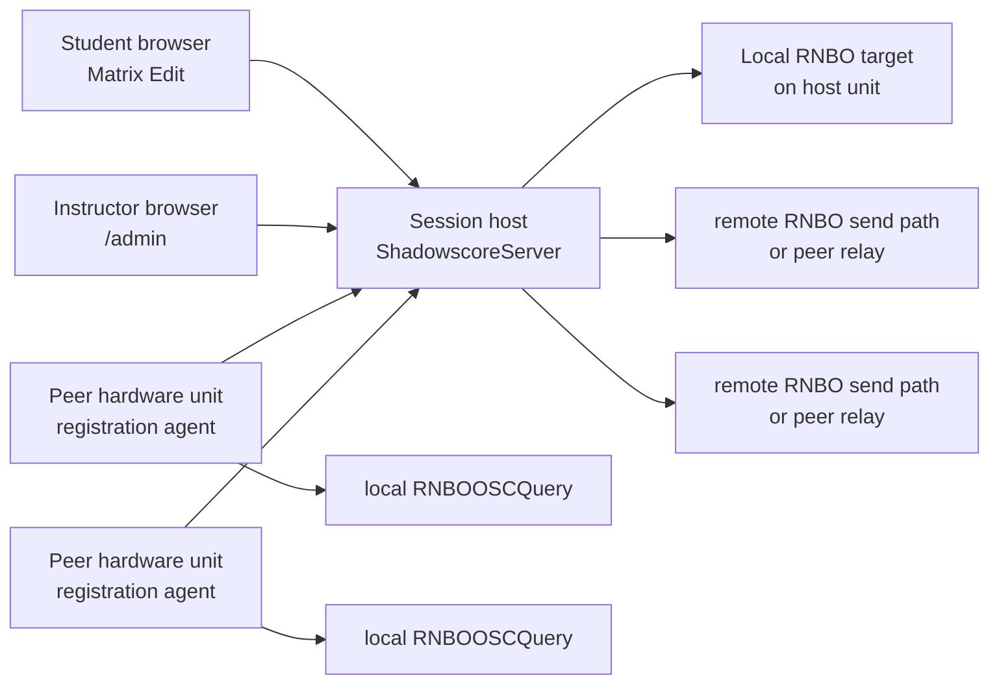

# Shadowbox Hardware Ensemble Plan

## Purpose

This plan describes the next implementation target for ShadowscoreServer on Shadowbox hardware units.

A Shadowbox hardware unit is a Raspberry Pi-based device that already runs the Shadowbox software. ShadowscoreServer will run alongside that existing software on the same hardware. The Shadowbox software remains responsible for its current local UI, audio, RNBO Runner integration, and device operation. ShadowscoreServer is responsible for ensemble score authority, browser collaboration, voice assignment, and forwarding committed ShadowScore documents into the selected RNBO targets.

The first field target used a six-unit ensemble, but six is a deployment preset rather than a data-model limit. Each Shadowbox hardware unit joins the local Wi-Fi network at boot. One ShadowscoreServer instance is selected as the session host. Browser clients open Matrix Edit from that local host and edit one assigned voice while seeing the rest of the ensemble as reference layers. A performer may manage multiple browser or RNBO clients, and a session may contain any practical number of voices.

## Terminology

- **Shadowbox hardware unit**: the physical Pi-based device.
- **Shadowbox software**: the existing software stack that runs on the Shadowbox hardware unit.
- **ShadowscoreServer**: the ensemble score authority and browser collaboration server.
- **Session host**: the one ShadowscoreServer instance chosen to own the active ensemble score.
- **Peer hardware unit**: a Shadowbox hardware unit that is participating in the session but is not the session host.
- **RNBOOSCQuery**: the local RNBO discovery surface used to inspect running RNBO instances, params, messages, and inports on a hardware unit.
- **Voice**: one editable ShadowScore note document in the ensemble score.
- **Client**: a browser, RNBO, or other software surface connected to the session. Clients are not counted as voices and multiple clients may be associated with the same performer or assignment.
- **RNBO target**: a specific RNBO instance/message path that can receive a ShadowScore document.

## Target User Flow

1. Shadowbox hardware units power on and join the local Wi-Fi network.
2. The Shadowbox software starts normally on each hardware unit.
3. ShadowscoreServer starts normally on each hardware unit, using ports that do not collide with Shadowbox software, RNBO Runner, or RNBOOSCQuery.
4. One ShadowscoreServer instance is chosen as the session host.
5. Peer hardware units register their available RNBO targets with the session host.
6. A student opens a browser to the session host's local Matrix Edit page, either by typing the URL or scanning a QR code.
7. The Matrix Edit page shows connection state and available voices.
8. The student selects one voice to edit. The selected voice renders at full opacity; all other voices render at reduced opacity.
9. Voice colors and labels come from ShadowscoreServer assignments.
10. Edits are sent to the session host, broadcast to connected browsers, persisted, and forwarded to the appropriate RNBO target.

## Architecture

The first implementation should prefer explicit session hosting over automatic host election.

Each Shadowbox hardware unit may run ShadowscoreServer, but only one instance should be active as the score authority for a given session. The others should behave as registrants and RNBO target providers. This avoids split-brain score state while still allowing any unit to become the session host if needed.

## Repository Work

### ShadowscoreServer

ShadowscoreServer needs the hardware-session features that make it usable as the local ensemble host.

- Add a hardware deployment document for Pi install, update, service start, and log inspection.
- Add a systemd unit template for ShadowscoreServer.
- Add a production config profile for Shadowbox hardware.
- Add a local app hosting route for the built Matrix Edit artifact.
- Add a machine-readable `GET /session` endpoint that reports ensemble id, server role, advertised name, host identity, voices, assignments, and connected hardware units.
- Add a registration API for peer hardware units.
- Add a heartbeat/expiry model for registered hardware units and RNBO targets.
- Add server-side target metadata to assignments so a voice can resolve to a hardware unit, RNBO instance id, and message path.
- Add a hardware-friendly `/admin` flow for choosing the session host role, viewing registered targets, assigning voices, and copying or displaying the Matrix Edit URL.
- Add tests for registration, heartbeat expiry, target assignment, and session snapshot output.

### Shadowbox Software

The Shadowbox software repo should gain the minimal integration needed for peaceful coexistence and hardware registration.

- Document the port map used by Shadowbox software, RNBO Runner, RNBOOSCQuery, and ShadowscoreServer.
- Add install/update commands for ShadowscoreServer, probably by pulling from GitHub on the hardware unit.
- Add a systemd service dependency policy so ShadowscoreServer starts after networking and does not block the Shadowbox software if it fails.
- Add or package a small registration agent that queries local RNBOOSCQuery and registers discovered RNBO targets with the selected session host.
- Add local configuration for the session host URL.
- Add a simple health/log command that reports Shadowbox software state, ShadowscoreServer state, RNBO Runner state, RNBOOSCQuery state, and the current registration state.
- Avoid changing existing Shadowbox UI/audio behavior unless the user explicitly opts into a ShadowScore screen or menu later.

### matrixedit

Matrix Edit should become the browser app served by the local session host.

- Keep the existing `obo` cloud/staging build path available for standalone MIDI-oriented use.
- Add a distinct hardware/server-oriented build target, provisionally named ShadowScore Matrix Edit, that can be copied into or served by ShadowscoreServer.
- Add a connection screen that can show "no server selected", "connecting", "connected", and error states.
- Support explicit local server URL input for development and fallback.
- Default to the local server when served from ShadowscoreServer.
- Read `GET /session` or `GET /score` to populate voices and assignments.
- Render all voices in the same grid.
- Render the selected voice at full opacity and non-selected voices at reduced opacity.
- Treat voice selection like a radio group: exactly one editable voice at a time.
- Use assignment colors consistently for note layers and voice controls.
- Send presence updates over `/collab` so other browsers can see which voice is being edited.
- Preserve version-guarded writes so stale same-voice edits produce visible errors rather than silent overwrites.
- Add tests for voice selection, layer opacity, assignment color mapping, and server connection states.

## Phases

### Phase 1: Local Host Prototype

Goal: one Shadowbox hardware unit hosts ShadowscoreServer and serves Matrix Edit locally.

- Build Matrix Edit as static assets.
- Add a ShadowscoreServer static route for those assets.
- Verify a laptop can open the app from the hardware unit over Wi-Fi.
- Verify the app loads `/score`, subscribes to realtime updates, and writes one selected voice.
- Keep RNBO output pointed at the local hardware unit only.

Exit criteria:

- `http://<host>.local:8790/matrix-edit` opens Matrix Edit.
- `/healthz`, `/score`, `/session`, `/admin`, and `/collab` work from a laptop.
- A selected voice can be edited and persisted.
- Existing Shadowbox software still starts and operates normally.

### Phase 2: RNBO Target Discovery

Goal: the session host can derive RNBO target information from RNBOOSCQuery.

- Implement a local RNBOOSCQuery inspection helper.
- Identify ShadowScoreClient RNBO instances by message path, metadata, or explicit config.
- Register discovered targets into ShadowscoreServer's session model.
- Display discovered targets in `/admin`.
- Allow an assignment to bind a voice to one RNBO target.

Exit criteria:

- A hardware unit reports at least one RNBO target such as `ShadowScoreClient / shadowscore`.
- The admin page can bind `player-1` to that target.
- A committed score update sends to the bound RNBO message path.
- Stale or missing RNBOOSCQuery data does not crash ShadowscoreServer.

### Phase 3: Multi-Unit Registration

Goal: peer Shadowbox hardware units register with the selected session host.

- Add peer registration and heartbeat endpoints. Done: `/hardware/register` accepts a unit document and `/hardware/units/:unitId/heartbeat` refreshes liveness.
- Add registration-agent config for `sessionHostUrl`. Done: `registration.sessionHostUrl`, heartbeat interval, and TTL are part of config.
- Query each peer's local RNBOOSCQuery and register targets with the host. Done: `npm run agent` discovers local RNBOOSCQuery targets and posts them to the host.
- Expire missing peers cleanly after missed heartbeats. Done: stale peers remain visible as offline and their targets become unavailable without deleting saved assignments.
- Surface online/offline state in `/session` and `/admin`. Done: `/session`, `/hardware/units`, `/rnbo/targets`, and `/admin` expose registered unit status.

Exit criteria:

- At least two hardware units appear on the host admin page.
- Each unit reports its discovered RNBO targets.
- Offline units become unavailable without deleting saved assignments.
- Browser clients can see voices assigned to different hardware units.

### Phase 4: Ensemble Matrix Edit UI

Goal: Matrix Edit supports an arbitrary-size ensemble workflow.

- Replace single-target editing assumptions with server voice assignment state.
- Add the voice radio-list UI using server labels and colors.
- Render all voice layers at once.
- Apply full opacity to the editable voice and reduced opacity to other voices.
- Send presence updates for active voice selection.
- Show stale-write and disconnected-server states clearly.

Exit criteria:

- All voices reported by `/session` are visible in Matrix Edit.
- Exactly one voice is editable at a time.
- Assignment colors are stable across reloads.
- Other browsers receive updates without manual refresh.

### Phase 5: Hardware Deployment Path

Goal: the system can be installed and updated repeatedly on actual Shadowbox hardware units.

- Publish ShadowscoreServer to GitHub.
- Add Pi install/update commands. Done: `deploy/install-shadowscore.sh` handles prerequisites, clone/update, generated config with bundled Matrix Edit and Event List routes, install-dir aware systemd install, service start, editor readiness checks, and smoke testing; `docs/deployment/shadowbox-hardware.md` documents fresh install and update commands for `/home/pi/ShadowscoreServer`.
- Add systemd unit templates and config examples. Done: `deploy/systemd/shadowscore-server.service`, `deploy/systemd/shadowscore-registration-agent.service`, `config/shadowbox.hardware-host.json`, and `config/shadowbox.hardware-peer.json`.
- Add a smoke-test command for the hardware unit. Done: `npm run smoke:hardware -- --config <config>` checks the server, bundled Matrix Edit and Event List pages, RNBO targets, HTTP port, RNBOOSCQuery when enabled, and peer host visibility when applicable.
- Add a deployment checklist that verifies ports, services, browser access, RNBOOSCQuery, registration, persistence, and RNBO output. Done: see the checklist in `docs/deployment/shadowbox-hardware.md`.

Exit criteria:

- A fresh hardware unit can install ShadowscoreServer from GitHub.
- Updating from GitHub does not disturb existing Shadowbox software state.
- Services restart cleanly after reboot.
- The checklist catches missing network, port, bundled editor, RNBOOSCQuery, and registration problems.

Phase 5 server-side status:

- Hardware host and peer config examples are present under `config/`.
- Systemd templates are present under `deploy/systemd/`.
- `deploy/install-shadowscore.sh` provides an idempotent install/update path for host and peer hardware units.
- The hardware deployment guide covers fresh install, update, service install, log inspection, smoke testing, and pre-session validation.
- The hardware smoke command is test-covered and available through `npm run smoke:hardware`.

### Phase 6: Session UX Polish

Goal: make the classroom flow robust enough for students.

- Add a QR code or copyable local URL in `/admin`.
- Add a clear "no session host selected" or "server unavailable" state for Matrix Edit when opened outside the session host.
- Add friendly device labels such as `Shadowbox A / Source`.
- Add assignment presets for common layouts, including the initial six-Shadowbox lab layout.
- Add backup/restore controls for the ensemble score snapshot.

Exit criteria:

- An instructor can start a session without editing config files.
- Students can connect with a URL or QR code.
- The ensemble can recover from a browser refresh or one hardware unit reboot.

Phase 6 server-side status:

- `/admin` now shows the Matrix Edit session URL, a copy button, and a QR image for student connection.
- Matrix Edit reports a clear unavailable state when it is opened against a non-host server or unreachable session endpoints.
- RNBO target displays use friendly labels such as `Shadowbox A / Source` when ShadowScoreClient targets are discovered.
- `ensemble.assignmentPresets` supports a default six-Shadowbox layout with `Shadowbox A / Source` through `Shadowbox F / Source`; this is a convenience preset, not a protocol limit.
- `/admin/backup`, `/admin/restore`, and admin page controls support downloading and restoring ensemble score snapshots.

## Coexistence Requirements

- ShadowscoreServer must not bind ports already used by Shadowbox software, RNBO Runner, or RNBOOSCQuery.
- RNBO/OSC output must remain explicitly configured and must not default to RNBO Runner's common UDP ports by accident.
- ShadowscoreServer failure must not prevent the Shadowbox software from booting.
- Shadowbox software updates and ShadowscoreServer updates should be separate operations unless a release explicitly couples them.
- Persistent score data should live outside generated build folders.
- Logs should make it clear whether an issue belongs to Shadowbox software, ShadowscoreServer, RNBO Runner, RNBOOSCQuery, or network registration.

## Open Decisions

These are the remaining design questions after the first hardware architecture pass:

- How the session host is selected for the first classroom version: fixed hostname, instructor choice, config file, or later discovery.
- Which ShadowScoreClient query opcodes are needed so ShadowscoreServer can inspect or validate a target beyond detecting that the ShadowScoreClient instance exists.
- Whether the first implementation should call the server-hosted app ShadowScore Matrix Edit, `shadow-score-matrix-edit`, or another name that clearly distinguishes it from the existing `obo` app on `stretta.com`.

These questions are no longer open for the first implementation:

- Peer hardware units do not need a custom RNBO message relay path. If an application needs to send messages directly to an RNBO instance, OSC remains the direct transport.
- The existing `obo` app can remain published at `stretta.com` for standalone MIDI-oriented applications. Ensemble use requires ShadowscoreServer, so the server-hosted app should be treated as a related ShadowScore-specific Matrix Edit surface rather than the same deployment target.
- A ShadowScore-capable RNBO target is identified initially by the presence of a ShadowScoreClient instance. Additional target introspection can be added through ShadowScoreClient opcodes if needed.
- Assignment colors should start from configured contrasting colors or assignment presets. Editable color UI is out of scope for now.

## First Implementation Slice

The smallest useful slice is:

1. Add a static Matrix Edit hosting route to ShadowscoreServer.
2. Add `GET /session`.
3. Add a simple local hardware config with a starter voice set and colors.
4. Build Matrix Edit into a folder that ShadowscoreServer can serve.
5. Verify one hardware unit can host the app and edit/persist one selected voice without affecting the existing Shadowbox software.

Phase 1 server-side status:

- Static Matrix Edit hosting is implemented for `/matrix-edit` with `/` retained as a compatibility alias, backed by `public/matrix-edit`.
- `GET /session` reports host role, advertised name, app/API endpoints, voices, assignments, local RNBO config, and an empty hardware-unit list for the local-host prototype.
- `config/shadowbox.local.json` defines a starter voice set with fixed contrasting assignment colors and keeps RNBO output pointed at `127.0.0.1:9000`.
- `public/matrix-edit/index.html` is a lightweight local browser prototype. It can be replaced by a full Matrix Edit static build while preserving the same `/matrix-edit` server route.

This proves the browser and score-authority shape before adding peer registration and multi-unit RNBO routing.

Phase 2 server-side status:

- RNBOOSCQuery discovery is implemented for local ShadowScoreClient message targets under paths such as `/rnbo/inst/2/messages/in/shadowscore`.
- `GET /session` and `GET /rnbo/targets` expose discovered targets, falling back to configured RNBO targets when discovery is disabled or empty.
- `/admin` displays discovered targets and can bind a voice assignment to a target.
- Voice assignments now persist RNBO target metadata: target id, host, port, and message address.
- RNBO sends prefer assignment-bound targets, so a committed voice update can route to the bound RNBO message path.
- Missing or stale RNBOOSCQuery data returns an empty discovery result and does not crash the server.
